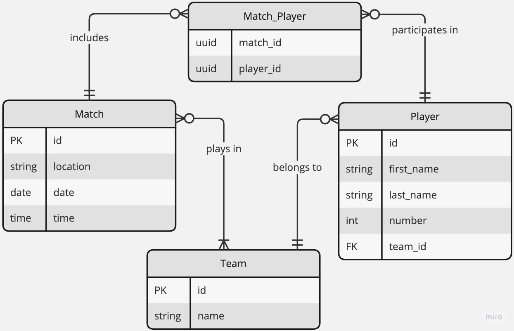

# Game-Arena

## Description

`Game-Arena` is an innovative platform designed for an abstract sports game experience. 

## Features
- `Local Database Integration` - Data is fetched from a locally hosted MySQL database, containing simulated data for an abstract sports game environment.
- `GraphQL API`: The API offers extensive querying capabilities, including:
  - Retrieving a list of matches.
  - Accessing a list of players.
  - Fetching a list of teams.
  - Obtaining a list of players for a specific team.
  - Retrieving the team associated with a specific player.
  - Listing teams and their players for a specific match.
  - Viewing match history for a specific player, including the teams they played for.

## Technologies
- `Backend`: Developed using NodeJS with the NestJS framework.
- `Database`: MySQL database, managed using Sequelize as the ORM.
- `GraphQL`: Implements a GraphQL server with a "code first" approach.

## Getting Started

### Installation

1. Clone the repository.
2. Install dependencies using `yarn`.
3. Configure your SQL database.

### Running the app

```bash
# development
$ yarn start

# watch mode
$ yarn start:dev
```

## Data model

### Entities

`Player` Entity
  - `id`: Primary Key, unique identifier for each player.
  - `first_name`: String, the first name of the player.
  - `last_name`: String, the last name of the player.
  - `number`: Number, the player's number in the team.
  - `team_id`: Foreign Key, references the id in the Team entity.

`Team` Entity
  - `id`: Primary Key, unique identifier for each team.
  - `name`: String, the name of the team.

`Match` Entity:
- `id`: Primary Key, unique identifier for each match.
- `location`: String, the location where the match takes place.
- `date`: Date, the date when the match is scheduled.
- `time`: Time, the time when the match is scheduled.

`Match_Player` Entity (Associative Entity for Many-to-Many Relationship):
  - `match_id`: Foreign Key, references id in the Match entity.
  - `player_id`: Foreign Key, references id in the Player entity.

### Entity – Relationship Diagram

Team to Player (One-to-Many)
  - Each `player` belongs to one `team`.
  - A `team` can have multiple `players`.

Player to Match (Many-to-Many)
  - A `player` can participate in multiple `matches`.
  - A `match` can include `players` from different `teams`. This relationship is represented through the `Match_Player` entity.

Team to Match (Many-to-Many)
  - A `team` participates in multiple `matches`.
  - Each `match` involves multiple `teams`. This relationship is indirectly represented through the `players` participating in the `matches`.

### Entity Relationship Diagram


