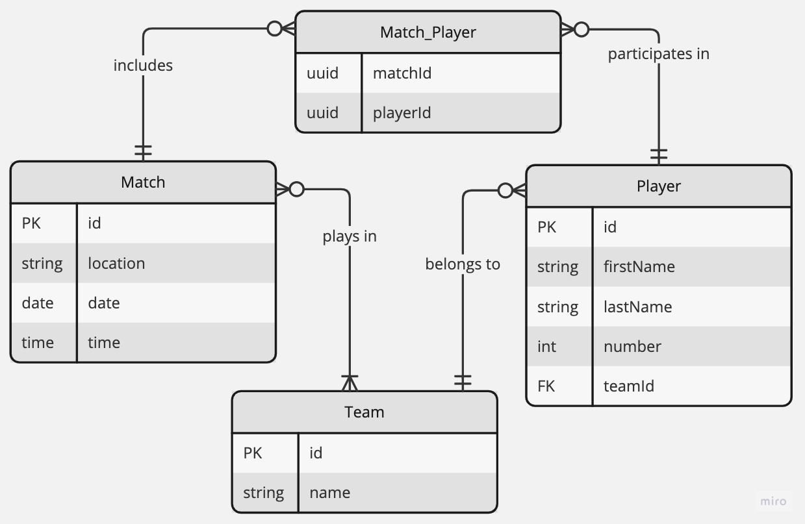

# Game-Arena

## Description

`Game-Arena` is an innovative platform designed for an abstract sports game experience. 

## Features
- `Local Database Integration` - Data is fetched from a locally hosted MySQL database, containing simulated data for an abstract sports game environment.
- `GraphQL API`: The API offers extensive querying capabilities, including:
  - Retrieving a list of matches.
  - Accessing a list of players.
  - Fetching a list of teams.
  - Obtaining a list of players for a specific team.
  - Retrieving the team associated with a specific player.
  - Listing teams and their players for a specific match.
  - Viewing match history for a specific player, including the teams they played for.

## Technologies
- `Backend`: Developed using NodeJS with the NestJS framework.
- `Database`: MySQL database, managed using Sequelize as the ORM.
- `GraphQL`: Implements a GraphQL server with a "code first" approach.

## Getting Started

### Installation

1. Clone the repository.
2. Install dependencies using `yarn`.
3. Configure your MySQL database.

### Configuration

Before running the application, you need to set up the environment variables:
- Copy the `.env.example` file and rename it to `.env`.
- Replace the default values of variables with your specific settings.

### Running the app

```bash
# development
$ yarn start

# watch mode
$ yarn start:dev
```

## Data model

### Entities

`Player` Entity
  - `id`: Primary Key, unique identifier for each player.
  - `first_name`: String, the first name of the player.
  - `last_name`: String, the last name of the player.
  - `number`: Number, the player's number in the team.
  - `team_id`: Foreign Key, references the id in the Team entity.

`Team` Entity
  - `id`: Primary Key, unique identifier for each team.
  - `name`: String, the name of the team.

`Match` Entity:
- `id`: Primary Key, unique identifier for each match.
- `location`: String, the location where the match takes place.
- `date`: Date, the date when the match is scheduled.
- `time`: Time, the time when the match is scheduled.

`Match_Player` Entity (Associative Entity for Many-to-Many Relationship):
  - `match_id`: Foreign Key, references id in the Match entity.
  - `player_id`: Foreign Key, references id in the Player entity.

### Entity – Relationship Diagram

Team to Player (One-to-Many)
  - Each `player` belongs to one `team`.
  - A `team` can have multiple `players`.

Player to Match (Many-to-Many)
  - A `player` can participate in multiple `matches`.
  - A `match` can include `players` from different `teams`. This relationship is represented through the `Match_Player` entity.

Team to Match (Many-to-Many)
  - A `team` participates in multiple `matches`.
  - Each `match` involves multiple `teams`. This relationship is indirectly represented through the `players` participating in the `matches`.

### Entity Relationship Diagram



## Testing

### Paginated Queries

Our GraphQL API now supports pagination in queries for `matches`, `players`, and `teams`. 
Use parameters like `first`, `last`, `before`, `after`, and `order` to efficiently access specific data segments. Responses follow a paginated structure, featuring an `edges` array with `node` elements (individual items) and pagination cursors. 
The `pageInfo` object in responses provides navigational details like `startCursor` (first item's cursor), `endCursor` (last item's cursor), `hasNextPage` (existence of items beyond the set limit), and `hasPreviousPage` (existence of items before the current starting point), enhancing data management in large datasets.

Example:
```graphql
query {
  players(first: 10, after: 10, order: ASC) {
    edges {
      node {
        id
      }
      cursor
    }
    pageInfo {
      startCursor
      endCursor
      hasNextPage
      hasPreviousPage
    }
  }
}
```

### Available Queries (examples)

#### Get a paginated list of matches
```graphql
query {
  matches(first: 5, order: ASC) {
    edges {
      node {
        id
        location
        date
        time
      }
    }
  }
}
```

#### Get a paginated list of players
```graphql
query {
  players(last: 5, before: 10, order: DESC) {
    edges {
      node {
        id
        firstName
        lastName
        number
      }
    }
  }
}
```

#### Get a paginated list of teams
```graphql
query {
  teams(first: 10, after: 5, order: ASC) {
    edges {
      node {
        id
        name
      }
    }
  }
}
```

#### Get a list of players for a specific team
```graphql
query {
  playersPerTeam(teamId: 1) {
    id
    firstName
    lastName
    number
  }
}
```

#### Get the team associated with a specific player.
```graphql
query {
  teamPerPlayer(playerId: 1) {
    name
  }
}
```

#### Get teams and their players for a specific match.
```graphql
query {
  teamsWithPlayersPerMatch(matchId: 1) {
    name
    players {
      id
    }
  }
}
```

#### Get match history for a specific player, including the teams they played for.
```graphql
query {
  matchesPerPlayer(playerId: 1) {
    id
    location
    date
    time
    players {
      id
      team {
        name
      }
    }
  }
}
```